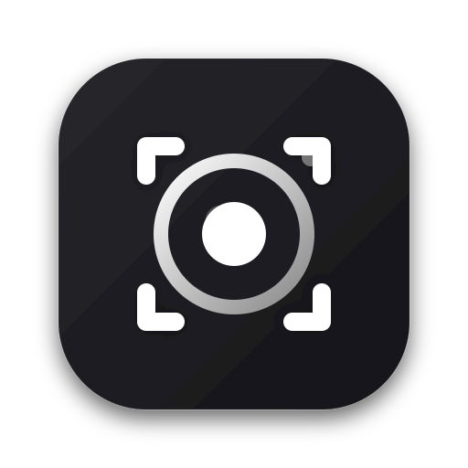

<div align="center">
  
  <h1>OpenSnap</h1>
  <p><strong>Free, open-source screenshot tool with annotations, backgrounds & effects</strong></p>

  
  
  
  
</div>

> Inspired by [OpenScreen](https://github.com/siddharthvaddem/openscreen).


---

## Features

### Capture
- **Region capture** — drag to select any area across all connected monitors simultaneously
- **Full screen capture** — one hotkey, instant grab of the primary display
- **Window capture** — pick any open window from the source picker
- **Pixel-perfect magnifier** — loupe with 3× zoom follows your cursor during region selection for sub-pixel accuracy
- **Color picker** — press `C` during region capture to copy the hex color of any pixel under your cursor
- **Clipboard safety net** — screenshot is copied to clipboard the moment you confirm a capture, before the editor even opens. Close the window without clicking Copy and you still have it

### Annotation
- **Select tool** — click and drag annotations to reposition them; forgiving hit-detection on arrows, circles, and rectangles
- **Text** — click anywhere on the screenshot to place a text label
- **Arrows** — draw directional arrows with automatic arrowheads
- **Rectangles & Circles** — draw shapes directly on your screenshot
- **Blur** — redact sensitive areas with a gaussian blur region
- **Step labels** — numbered circle badges (①②③…) for step-by-step guides
- **Color palette** — quick color picker in the toolbar
- **Undo / Redo** — full annotation history with `Ctrl+Z` / `Ctrl+Y`
- **Clear all** — erase all annotations at once

### Beautify
- **Backgrounds** — solid colors, gradients (with angle control), or transparent
- **Gradient presets** — a curated set of gradient palettes
- **Drop shadow** — adjustable blur, offset, and opacity
- **Shadow Backdrop** — macOS-style soft ambient glow mode
- **Stroke (border)** — color, width, and corner radius
- **Padding** — add breathing room around the screenshot (0–200 px)
- **Scale** — zoom the canvas preview from 10% to 100%
- **Zoom & Pan** — scroll to zoom around the cursor; middle-click/Hand tool to pan; sidebar slider zooms around the viewport center

### Export
- **Copy to clipboard** — `Ctrl+C` or the Copy button; window hides automatically since the image is safe in the clipboard
- **Save as file** — PNG, JPG, or WebP via native save dialog
- **Crop** — freehand crop to any region before exporting; Confirm or Cancel inline
- **Pin to Screen** — float the screenshot as a borderless always-on-top overlay; press `Esc` to dismiss
- **OCR / Extract Text** — run Tesseract OCR on the screenshot and copy recognized text to the clipboard

### System
- **Global hotkeys** — fully customizable; record any key combination directly in Settings
- **System tray** — runs silently in the background; double-click the tray icon to show/hide
- **Minimize to tray** — optionally hide to tray on minimize
- **Close to tray** — optionally keep the app running when the main window is closed
- **Start with system** — optional auto-launch at login
- **Start minimized** — optional launch without showing the window
- **Multi-monitor** — overlay appears on every display simultaneously during region capture
- **Responsive UI** — toolbar and sidebar adapt to narrow windows; sidebar can be toggled on small screens

---

## Default Hotkeys

| Action | Windows / Linux | macOS |
|--------|----------------|-------|
| Region capture | `Ctrl+Shift+S` | `Cmd+Shift+S` |
| Full screen capture | `Ctrl+Shift+F` | `Cmd+Shift+F` |
| Show source picker | `Alt+S` | `Alt+S` |
| Quick full screen | `Alt+F` | `Alt+F` |
| Undo | `Ctrl+Z` | `Cmd+Z` |
| Redo | `Ctrl+Y` | `Cmd+Y` |
| Confirm region | `Enter` | `Enter` |
| Cancel capture | `Esc` | `Esc` |
| Copy pixel color | `C` *(during region capture)* | `C` *(during region capture)* |

All capture hotkeys are re-recordable in **Settings → Keyboard Shortcuts**.

---

## Getting Started

### Prerequisites

- Node.js 18+
- npm

### Development

```bash
git clone https://github.com/Just-Haze/opensnap.git
cd opensnap
npm install
npm run dev
```

### Building a release

```bash
npm run build          # current platform
npm run build:win      # Windows installer
npm run build:mac      # macOS .dmg
npm run build:linux    # Linux AppImage / deb
```

Download the latest pre-built release: **[Releases →](https://github.com/Just-Haze/opensnap/releases/latest)**

---

## Usage

1. Launch OpenSnap (or trigger it via hotkey from the tray)
2. Pick a source — drag-select a region, grab the full screen, or choose a specific window
3. The screenshot is instantly on your clipboard as a fallback
4. Tweak background, shadow, border, and padding in the Inspector sidebar
5. Annotate with the toolbar — arrows, text, shapes, blur, or numbered steps
6. Hit **Copy** or **Export** when you're done — or **Pin** it to keep it floating on screen

---

## Settings

Open Settings from the title bar gear icon or tray menu.

| Section | Options |
|---------|---------|
| **General** | Start with system, Start minimized, Minimize to tray, Close to tray, Theme (Light / Dark / System) |
| **Capture** | Default save location, Default format (PNG / JPG), JPEG quality slider |
| **Keyboard Shortcuts** | Live hotkey recorder — click Record, press your combo, click Save |
| **Notifications** | Toggle system tray notifications |

---

## Platform Notes

- **Windows** — full support; transparent window, custom title bar, global shortcuts with `Ctrl`
- **macOS** — native `hiddenInset` title bar with traffic lights; global shortcuts with `Cmd`; transparent window
- **Linux (X11)** — full support with transparent window
- **Linux (Wayland)** — transparent window is disabled automatically to prevent compositor crashes; all other features work normally

---

## License

MIT — free to use, modify, and distribute.

## Credits

Inspired by [OpenScreen](https://github.com/siddharthvaddem/openscreen) by [@siddharthvaddem](https://github.com/siddharthvaddem)
