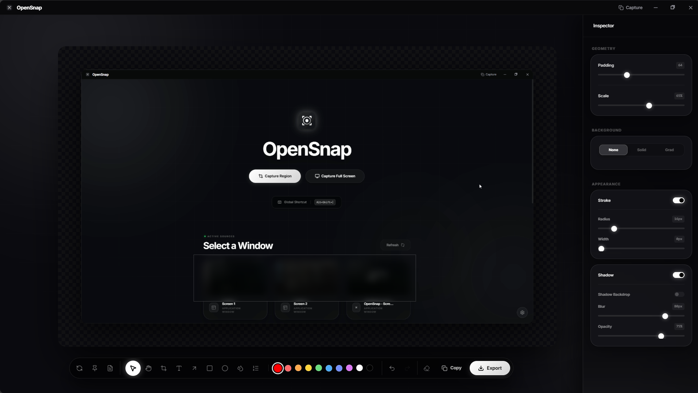

# OpenSnap

> **Status: Beta** — OpenSnap is in active development. Expect occasional rough edges.

A free, open-source screenshot tool for Windows with beautiful backgrounds, annotations, and a clipboard-first workflow. Inspired by [OpenScreen](https://github.com/siddharthvaddem/openscreen).



---

## Features

### Capture
- **Region capture** — drag to select any area across all connected monitors
- **Full screen capture** — one hotkey, instant grab
- **Window capture** — pick any open window from the source picker
- **Clipboard safety net** — screenshot is copied to clipboard the moment you confirm a capture, before the editor even opens. Close the window without clicking Copy and you still have it

### Annotation
- **Select tool** — click and drag annotations to reposition them; forgiving hit detection on arrows, circles, and rectangles
- **Text, Arrows, Rectangles, Circles** — draw directly on your screenshot
- **Undo / Redo** — full history with `Ctrl+Z` / `Ctrl+Y`
- **Color picker** — quick palette in the toolbar

### Beautify
- **Backgrounds** — solid colors, gradients, or transparent
- **Drop shadow** — adjustable blur, offset, and opacity
- **Border** — color, width, and corner radius
- **Padding** — add breathing room around the screenshot
- **Zoom & Pan** — scroll to zoom, middle-click or Hand tool to pan

### Export
- **Copy to clipboard** — `Ctrl+C` or the Copy button; window closes automatically since the image is safe in clipboard
- **Save as file** — PNG, JPG, or WebP via a save dialog
- **Crop** — trim to any region before exporting

### System
- **Global hotkeys** — customizable in settings
- **System tray** — stays out of your way until you need it
- **Multi-monitor** — overlay appears on every display during region capture

---

## Default Hotkeys

| Action | Shortcut |
|--------|----------|
| Region capture | `Ctrl+Shift+S` |
| Full screen capture | `Ctrl+Shift+F` |
| Undo | `Ctrl+Z` |
| Redo | `Ctrl+Y` |
| Confirm region / copy | `Enter` |
| Cancel capture | `Esc` |

All hotkeys are configurable in **Settings**.

---

## Getting Started

### Prerequisites

- Node.js 18+
- npm

### Development

```bash
git clone https://github.com/Just-Haze/opensnap.git
cd opensnap
npm install
npm run dev
```

### Building a release

```bash
npm run build        # current platform
npm run build:win    # Windows installer
```

Download the latest pre-built release: **[Releases →](https://github.com/Just-Haze/opensnap/releases/latest)**

---

## Usage

1. Launch OpenSnap (or trigger it via hotkey from the tray)
2. Pick a source — region, full screen, or a specific window
3. The screenshot is instantly on your clipboard as a fallback
4. Tweak background, shadow, border, and padding in the sidebar
5. Annotate with the toolbar — arrows, text, shapes
6. Hit **Copy** or **Export** when you're done

---

## License

MIT — free to use, modify, and distribute.

## Credits

Inspired by [OpenScreen](https://github.com/siddharthvaddem/openscreen) by [@siddharthvaddem](https://github.com/siddharthvaddem)
